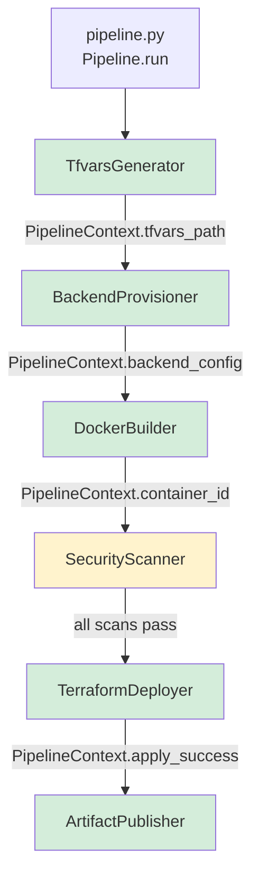

# Design Document: terraform-python-pipeline

## Overview

The terraform-python-pipeline is a Python orchestrator that executes six sequential, gate-controlled stages to deploy Terraform-managed cloud infrastructure on either Azure or AWS. It consolidates and extends the existing `Python/main.py`, `Python/build-docker-image.py`, and `Python/buikd-az-storage.py` scripts into a single entry point (`Python/pipeline.py`) with a shared stage interface, structured logging, and hard-stop failure semantics.

Each stage is a self-contained class. The top-level `Pipeline` runner instantiates them in order, calls `run()`, and halts on any non-success result. No stage is skipped; no stage runs out of order.

### Key Design Decisions

- **Single entry point**: `Python/pipeline.py` replaces ad-hoc script execution.
- **Stage protocol**: Every stage implements a common `Stage` base class with a `run(context) -> StageResult` method, making the pipeline trivially extensible.
- **Shared context object**: A mutable `PipelineContext` dataclass is threaded through all stages so outputs (backend config, tfvars path, container ID) are passed without global state.
- **Subprocess streaming**: Terraform commands use `subprocess.Popen` with line-by-line stdout streaming rather than `capture_output=True`, satisfying the real-time output requirement.
- **Docker SDK**: The existing `docker` Python SDK usage from `build-docker-image.py` is retained and wrapped inside `DockerBuilder` and `SecurityScanner`.
- **Cloud-agnostic backend**: `BackendProvisioner` is an abstract base; `AzureBackendProvisioner` and `AwsBackendProvisioner` are selected at runtime based on `ctx.cloud_provider`. The `BackendConfig` dataclass uses `Optional` fields so only the relevant provider fields are populated.
- **S3 native locking**: AWS backend uses S3 native state locking (Terraform >= 1.6 `use_lockfile = true`) — no DynamoDB table required.

---

## Architecture



Each arrow represents a gate: if the upstream stage returns a failure `StageResult`, the pipeline halts and the downstream stage never executes.

### File Layout

```
Python/
  pipeline.py          # entry point + Pipeline runner
  stages/
    __init__.py
    base.py            # Stage ABC, StageResult, PipelineContext, BackendConfig
    tfvars_generator.py
    azure_backend_provisioner.py
    aws_backend_provisioner.py
    docker_builder.py
    security_scanner.py
    terraform_deployer.py
    artifact_publisher.py
```

---

## Components and Interfaces

### Stage Base Class (`stages/base.py`)

```python
from abc import ABC, abstractmethod
from dataclasses import dataclass, field
from typing import Optional, Literal

@dataclass
class BackendConfig:
    provider: Literal["azure", "aws"]
    # Azure fields
    storage_account: Optional[str] = None
    container_name: Optional[str] = None
    blob_key: Optional[str] = None
    resource_group: Optional[str] = None
    # AWS fields
    bucket: Optional[str] = None
    key: Optional[str] = None
    region: Optional[str] = None

@dataclass
class ScanResult:
    tool: str          # "tfsec" | "checkov" | "trivy"
    passed: bool
    findings: list[str]

@dataclass
class PipelineContext:
    # inputs (set before pipeline starts)
    variables: dict
    cloud_provider: Literal["azure", "aws"]
    github_repo: str
    github_branch: str
    # Azure-specific inputs
    subscription_id: Optional[str] = None
    storage_account_name: Optional[str] = None
    # AWS-specific inputs
    s3_bucket_name: Optional[str] = None
    aws_region: Optional[str] = None

    # outputs (populated by stages)
    tfvars_path: Optional[str] = None
    backend_config: Optional[BackendConfig] = None
    container_id: Optional[str] = None
    scan_results: list[ScanResult] = field(default_factory=list)
    plan_file: Optional[str] = None
    apply_success: bool = False
    commit_sha: Optional[str] = None

@dataclass
class StageResult:
    success: bool
    message: str

class Stage(ABC):
    name: str

    @abstractmethod
    def run(self, ctx: PipelineContext) -> StageResult:
        ...
```

### TfvarsGenerator (`stages/tfvars_generator.py`)

Validates that all required keys are present in `ctx.variables`, serialises to JSON, writes to `<project_name>-<environment>.tfvars.json`, and sets `ctx.tfvars_path`.

Required keys: `project_name`, `environment`, `location`, `subnet_address`, `aks_subnet_address`, `vnet_address`, `should_delegate`, `enable_nat_gateway`, `node_count`.

### BackendProvisioner (abstract base in `stages/base.py`)

`BackendProvisioner` extends `Stage` with no additional interface. The pipeline selects the concrete implementation at startup based on `ctx.cloud_provider`:
- `"azure"` → `AzureBackendProvisioner`
- `"aws"` → `AwsBackendProvisioner`
- anything else → pipeline halts before any stage runs with a descriptive error

### AzureBackendProvisioner (`stages/azure_backend_provisioner.py`)

Uses the `azure-mgmt-storage` SDK to check for the storage account. Creates it (plus container and blob) if absent. Populates `ctx.backend_config` with `provider="azure"` and the Azure-specific fields. Wraps all Azure SDK calls in try/except and surfaces the raw API error on failure.

### AwsBackendProvisioner (`stages/aws_backend_provisioner.py`)

Uses `boto3` to check for the S3 bucket. Creates it if absent with native state locking enabled (`ObjectLockEnabled=True` / `use_lockfile = true` in the Terraform backend block — no DynamoDB table required). Populates `ctx.backend_config` with `provider="aws"` and the AWS-specific fields (`bucket`, `key`, `region`).

### DockerBuilder (`stages/docker_builder.py`)

Wraps the logic from `build-docker-image.py`:
1. Removes `workspace_build/` if it exists (`shutil.rmtree`).
2. Clones `https://github.com/thogue12/cloud-platform-pipelines.git` on `main`.
3. Builds image tagged `security-scanner` via `docker.from_env().images.build(...)`.
4. Starts the container in detached mode; sets `ctx.container_id`.

### SecurityScanner (`stages/security_scanner.py`)

Executes `tfsec`, `checkov`, and `trivy` sequentially via `docker exec` against the running container. Parses exit codes and stdout to produce a `ScanResult` per tool. If any result has `passed=False`, returns a failure `StageResult` with all findings logged.

### TerraformDeployer (`stages/terraform_deployer.py`)

Extends the logic from `main.py` with:
- `terraform init -backend-config=...` using values from `ctx.backend_config`. The flags passed depend on `ctx.backend_config.provider`:
  - `azure`: `-backend-config=resource_group_name=... -backend-config=storage_account_name=... -backend-config=container_name=... -backend-config=key=...`
  - `aws`: `-backend-config=bucket=... -backend-config=key=... -backend-config=region=... -backend-config=use_lockfile=true`
- `terraform plan -var-file=<ctx.tfvars_path> -out=tfplan`.
- `terraform apply tfplan`.
- All commands use `subprocess.Popen` for real-time streaming. Non-zero exit code → failure.

### ArtifactPublisher (`stages/artifact_publisher.py`)

Uses `PyGithub` (already in `build-docker-image.py`) to push `ctx.tfvars_path` to the configured repo/branch via the GitHub Contents API. Reads `GITHUB_TOKEN` from the environment; raises immediately if absent.

### Pipeline Runner (`pipeline.py`)

```python
STAGES = [
    TfvarsGenerator(),
    BackendProvisioner(),
    DockerBuilder(),
    SecurityScanner(),
    TerraformDeployer(),
    ArtifactPublisher(),
]

for stage in STAGES:
    log_stage_start(stage.name)
    result = stage.run(ctx)
    log_stage_end(stage.name, result)
    if not result.success:
        sys.exit(1)

sys.exit(0)
```

---

## Data Models

### PipelineContext

| Field | Type | Set By | Consumed By |
|---|---|---|---|
| `variables` | `dict` | caller | TfvarsGenerator |
| `cloud_provider` | `str` | caller | Pipeline (provisioner selection) |
| `github_repo` | `str` | caller | ArtifactPublisher |
| `github_branch` | `str` | caller | ArtifactPublisher |
| `subscription_id` | `str` (Azure only) | caller | AzureBackendProvisioner |
| `storage_account_name` | `str` (Azure only) | caller | AzureBackendProvisioner |
| `s3_bucket_name` | `str` (AWS only) | caller | AwsBackendProvisioner |
| `aws_region` | `str` (AWS only) | caller | AwsBackendProvisioner |
| `tfvars_path` | `str` | TfvarsGenerator | TerraformDeployer, ArtifactPublisher |
| `backend_config` | `BackendConfig` | BackendProvisioner | TerraformDeployer |
| `container_id` | `str` | DockerBuilder | SecurityScanner |
| `scan_results` | `list[ScanResult]` | SecurityScanner | (logged) |
| `plan_file` | `str` | TerraformDeployer | TerraformDeployer |
| `apply_success` | `bool` | TerraformDeployer | ArtifactPublisher |
| `commit_sha` | `str` | ArtifactPublisher | (logged) |

### BackendConfig

| Field | Type | Provider | Description |
|---|---|---|---|
| `provider` | `str` | both | `"azure"` or `"aws"` |
| `storage_account` | `str` | Azure | Azure storage account name |
| `container_name` | `str` | Azure | Blob container name (e.g. `tfstate`) |
| `blob_key` | `str` | Azure | State file path within container |
| `resource_group` | `str` | Azure | Resource group owning the storage account |
| `bucket` | `str` | AWS | S3 bucket name |
| `key` | `str` | AWS | State file path within the bucket |
| `region` | `str` | AWS | AWS region of the S3 bucket |

### ScanResult

| Field | Type | Description |
|---|---|---|
| `tool` | `str` | One of `"tfsec"`, `"checkov"`, `"trivy"` |
| `passed` | `bool` | True if exit code 0 and no critical findings |
| `findings` | `list[str]` | Raw finding lines from tool output |

### tfvars JSON Schema

```json
{
  "project_name": "string",
  "environment": "string",
  "location": "string",
  "subnet_address": ["string"],
  "aks_subnet_address": ["string"],
  "vnet_address": ["string"],
  "should_delegate": "boolean",
  "enable_nat_gateway": "boolean",
  "node_count": "integer"
}
```


---

## Correctness Properties

*A property is a characteristic or behavior that should hold true across all valid executions of a system — essentially, a formal statement about what the system should do. Properties serve as the bridge between human-readable specifications and machine-verifiable correctness guarantees.*

### Property 1: TfvarsGenerator write round-trip

*For any* dict containing all required Terraform variable keys with valid values, writing it via `TfvarsGenerator` and reading the resulting `.tfvars.json` file back should produce a dict equal to the original input.

**Validates: Requirements 1.1, 1.2**

---

### Property 2: Missing variable raises descriptive error

*For any* dict that is missing at least one required variable key, `TfvarsGenerator.run()` should return a failure `StageResult` whose message identifies the missing key by name.

**Validates: Requirements 1.3**

---

### Property 3: BackendProvisioner idempotence

*For any* storage account name that already exists in the mock Azure client, calling `BackendProvisioner.run()` should not invoke the storage account create API and should return a success `StageResult`.

**Validates: Requirements 2.3**

---

### Property 4: BackendConfig output matches provisioned values

*For any* valid subscription ID and storage account name, after `BackendProvisioner.run()` succeeds, `ctx.backend_config` should contain the exact storage account name, container name, and blob key that were used during provisioning.

**Validates: Requirements 2.2, 2.5**

---

### Property 5: Stage error propagation

*For any* stage and any error raised by its underlying operation (Azure API error, Docker error, subprocess non-zero exit, GitHub API error), the stage's `run()` method should return a `StageResult` with `success=False` and a non-empty message containing the error detail.

**Validates: Requirements 2.4, 3.4, 5.4, 6.4**

---

### Property 6: Pre-existing clone directory is removed before clone

*For any* pre-existing directory at the clone path, `DockerBuilder.run()` should remove that directory before invoking the git clone operation, such that the clone always starts from a clean state.

**Validates: Requirements 3.2**

---

### Property 7: ScanResult parsing produces correct structure

*For any* tool name and tool output string, the scan output parser should produce a `ScanResult` whose `tool` field matches the tool name, `passed` field correctly reflects whether the exit code was zero, and `findings` list is non-empty if and only if the output contained finding lines.

**Validates: Requirements 4.2**

---

### Property 8: Security gate decision matches scan results

*For any* list of `ScanResult` objects, `SecurityScanner.run()` should return a success `StageResult` if and only if every `ScanResult` in the list has `passed=True`; otherwise it should return a failure `StageResult`.

**Validates: Requirements 4.3, 4.4**

---

### Property 9: Missing GITHUB_TOKEN halts before any API call

*For any* pipeline context where the `GITHUB_TOKEN` environment variable is absent, `ArtifactPublisher.run()` should return a failure `StageResult` without making any call to the GitHub API.

**Validates: Requirements 6.2, 6.3**

---

### Property 10: Artifact push content matches tfvars file

*For any* `.tfvars.json` file path in `ctx.tfvars_path`, after `ArtifactPublisher.run()` succeeds, the content pushed to the GitHub API should be byte-for-byte equal to the content of the local file.

**Validates: Requirements 6.1**

---

### Property 11: Pipeline halts at first failing stage

*For any* pipeline stage index `i` that returns a failure `StageResult`, no stage at index `> i` should be executed, and the pipeline should exit with a non-zero code.

**Validates: Requirements 7.1, 7.2, 7.3**

---

### Property 12: Stage log entries contain timestamps

*For any* stage execution, the log output captured from the pipeline runner should contain both a start entry and a completion entry for that stage, each including a parseable ISO-format timestamp.

**Validates: Requirements 7.4**

---

### Property 13: Cloud provider selection routes to correct provisioner

*For any* `cloud_provider` value of `"azure"` (case-insensitive), the pipeline should instantiate `AzureBackendProvisioner` and not `AwsBackendProvisioner`; and vice versa for `"aws"`.

**Validates: Requirements 8.1, 8.2, 8.3**

---

### Property 14: AwsBackendProvisioner idempotence

*For any* S3 bucket name that already exists in the mock AWS client, calling `AwsBackendProvisioner.run()` should not invoke the bucket create API and should return a success `StageResult`.

**Validates: Requirements 8.7**

---

### Property 15: Unsupported cloud provider halts pipeline before any stage

*For any* `cloud_provider` value that is not `"azure"` or `"aws"` (case-insensitive), the pipeline should return a failure result with a message identifying the unsupported value, and no stage should execute.

**Validates: Requirements 8.10**

---

### Property 16: BackendConfig provider field matches selected provisioner

*For any* valid `cloud_provider` input, after the BackendProvisioner stage succeeds, `ctx.backend_config.provider` should equal the normalised (lowercase) `cloud_provider` value.

**Validates: Requirements 8.11**

---

## Error Handling

| Failure Point | Detection | Response |
|---|---|---|
| Missing required tfvar | Key not in `ctx.variables` | `StageResult(success=False, message=f"Missing required variable: {key}")` → pipeline halts |
| Unsupported cloud provider | `ctx.cloud_provider` not in `{"azure", "aws"}` | `StageResult(success=False, message=f"Unsupported cloud_provider: {value}")` → pipeline halts before any stage |
| Azure API error | `azure.core.exceptions.AzureError` | Log full exception + API response body → `StageResult(success=False)` → halt |
| AWS API error | `botocore.exceptions.ClientError` | Log full exception + AWS error response → `StageResult(success=False)` → halt |
| Git clone failure | `git.exc.GitCommandError` | Log error → `StageResult(success=False)` → halt |
| Docker build failure | `docker.errors.BuildError` | Log build log lines containing `"error"` → `StageResult(success=False)` → halt |
| Docker exec non-zero | Exit code from `docker exec` | Captured in `ScanResult.passed=False` → security gate fires → halt |
| Terraform non-zero exit | `subprocess.Popen` returncode | Log command + exit code + stderr → `StageResult(success=False)` → halt |
| Missing `GITHUB_TOKEN` | `os.getenv("GITHUB_TOKEN") is None` | Raise before any API call → `StageResult(success=False)` → halt |
| GitHub API error | `github.GithubException` | Log status + response data → `StageResult(success=False)` → halt (no deployment rollback) |
| Keyboard interrupt | `KeyboardInterrupt` caught in `Pipeline.run()` | Log interruption → `sys.exit(1)` |

All errors are surfaced with the stage name, a human-readable message, and the raw error detail. The pipeline never silently swallows exceptions.

---

## Testing Strategy

### Dual Testing Approach

Both unit tests and property-based tests are required. They are complementary:

- **Unit tests** cover specific examples, integration sequencing, and edge cases (e.g., the exact order of terraform subcommands, the exact Docker tag used, SIGINT handling).
- **Property-based tests** verify universal correctness across all valid inputs (e.g., any valid variable dict round-trips correctly, any failing scan halts the gate).

### Property-Based Testing

**Library**: `hypothesis` (Python) — mature, well-maintained, integrates with `pytest`.

Each property from the Correctness Properties section maps to exactly one `@given`-decorated test. Minimum 100 iterations per test (Hypothesis default is 100; set `max_examples=100` explicitly for clarity).

Each test must include a comment referencing its design property:

```python
# Feature: terraform-python-pipeline, Property 1: TfvarsGenerator write round-trip
@given(st.fixed_dictionaries({
    "project_name": st.text(min_size=1),
    "environment": st.sampled_from(["dev", "test", "prod"]),
    ...
}))
@settings(max_examples=100)
def test_tfvars_round_trip(variables):
    ...
```

Tag format: `Feature: terraform-python-pipeline, Property {N}: {property_title}`

### Unit Tests (specific examples and edge cases)

- Stage ordering: verify the fixed stage sequence `[TfvarsGenerator, BackendProvisioner, DockerBuilder, SecurityScanner, TerraformDeployer, ArtifactPublisher]` is always used.
- Terraform subcommand sequencing: `init` → `plan` → `apply` in order, with correct flags.
- Docker image tag: `security-scanner` is passed to `images.build`.
- Clone URL and branch: `https://github.com/thogue12/cloud-platform-pipelines.git` on `main`.
- Exit code: pipeline returns `0` on full success, `1` on any stage failure.
- SIGINT: `KeyboardInterrupt` is caught and exits non-zero.

### Test File Layout

```
Python/tests/
  test_tfvars_generator.py           # Property 1, 2 + unit examples
  test_azure_backend_provisioner.py  # Property 3, 4, 5 (Azure mock)
  test_aws_backend_provisioner.py    # Property 14, 5 (boto3 mock)
  test_docker_builder.py             # Property 5, 6 + unit examples
  test_security_scanner.py           # Property 7, 8 + unit examples
  test_terraform_deployer.py         # Property 5 + unit examples
  test_artifact_publisher.py         # Property 9, 10 + unit examples
  test_pipeline.py                   # Property 11, 12, 13, 15, 16 + unit examples
```

### Mocking Strategy

- Azure SDK: mock `azure.mgmt.storage.StorageManagementClient` with `unittest.mock.MagicMock`.
- AWS SDK: mock `boto3.client("s3")` with `unittest.mock.MagicMock`; use `botocore.stub.Stubber` for response shaping.
- Docker SDK: mock `docker.from_env()` return value.
- Git: mock `git.Repo.clone_from`.
- GitHub: mock `github.Github` and `github.Repository.get_contents` / `create_file` / `update_file`.
- Subprocess: mock `subprocess.Popen` for Terraform commands.
- Environment variables: use `unittest.mock.patch.dict(os.environ, ...)`.


---

## Developer Guide

This section explains how each stage works in practice, what code it uses, and how to modify or extend the pipeline.

---

### How the Pipeline Runs

`Python/pipeline.py` is the single entry point. At the bottom of the file is a `PipelineContext` block — this is where you configure every run. When you execute `python pipeline.py`, the `run_pipeline()` function:

1. Normalises `cloud_provider` to lowercase and validates it is `"azure"` or `"aws"`. If not, it halts immediately before any stage runs.
2. Selects `AzureBackendProvisioner` or `AwsBackendProvisioner` based on that value.
3. Builds the ordered `stages` list and loops through it, calling `stage.run(ctx)` on each one.
4. After each stage it logs a timestamped start/end line. If `result.success` is `False`, it logs the failure reason and calls `sys.exit(1)`.
5. A `KeyboardInterrupt` (Ctrl+C) is caught at the loop level and also exits with code 1.

**To configure a run**, edit the `PipelineContext(...)` block at the bottom of `pipeline.py`:

```python
ctx = PipelineContext(
    cloud_provider="azure",       # change to "aws" for AWS
    variables={
        "project_name": "my-project",
        "environment": "dev",
        ...
    },
    github_repo="owner/repo",
    github_branch="main",
    subscription_id="...",        # Azure only
    storage_account_name="...",   # Azure only
    resource_group_name="...",    # Azure only
    # s3_bucket_name="...",       # AWS only
    # aws_region="us-east-1",     # AWS only
)
```

---

### Stage 1 — TfvarsGenerator (`stages/tfvars_generator.py`)

**What it does:** Validates that all 9 required Terraform variable keys are present in `ctx.variables`, then serialises the dict to a JSON file named `<project_name>-<environment>.tfvars.json` in the current working directory. Sets `ctx.tfvars_path` to the absolute path of that file so downstream stages can reference it.

**Key constant — `REQUIRED_KEYS`:** The list of keys that must be present. If you add a new Terraform variable to your root module, add its name here:

```python
REQUIRED_KEYS = [
    "project_name",
    "environment",
    ...
    "your_new_variable",   # add here
]
```

**To change the output filename format**, edit this line in `run()`:

```python
filename = f"{project_name}-{environment}.tfvars.json"
```

**Reads from context:** `ctx.variables`
**Writes to context:** `ctx.tfvars_path`

---

### Stage 2a — AzureBackendProvisioner (`stages/azure_backend_provisioner.py`)

**What it does:** Uses the `azure-mgmt-storage` SDK with `DefaultAzureCredential` to check whether the storage account named in `ctx.storage_account_name` exists inside `ctx.resource_group_name`. If it doesn't exist, it creates the storage account (`Standard_LRS`, `StorageV2`) and a blob container named `tfstate`. It then populates `ctx.backend_config` with all the values `TerraformDeployer` needs to build the `azurerm` backend flags.

**Key constants at the top of the file:**

```python
CONTAINER_NAME = "tfstate"       # name of the blob container created
BLOB_KEY = "terraform.tfstate"   # state file path inside the container
LOCATION = "eastus"              # region used when creating the storage account
```

Change `LOCATION` to match your Azure region. Change `CONTAINER_NAME` or `BLOB_KEY` if your naming convention differs.

**Authentication:** Uses `DefaultAzureCredential`, which tries (in order): environment variables, workload identity, managed identity, Azure CLI login. If you're running locally, `az login` is sufficient.

**Reads from context:** `ctx.subscription_id`, `ctx.storage_account_name`, `ctx.resource_group_name`
**Writes to context:** `ctx.backend_config` (provider=`"azure"`)

---

### Stage 2b — AwsBackendProvisioner (`stages/aws_backend_provisioner.py`)

**What it does:** Uses `boto3` to check whether the S3 bucket named in `ctx.s3_bucket_name` exists. If it doesn't, it creates the bucket with `ObjectLockEnabledForBucket=True` (native Terraform state locking — no DynamoDB needed) and enables versioning (required for object lock). Populates `ctx.backend_config` with the S3 values.

**Special case for `us-east-1`:** AWS rejects a `LocationConstraint` for `us-east-1`, so the code omits it for that region automatically — you don't need to change anything.

**Key constant:**

```python
STATE_KEY = "terraform.tfstate"   # path of the state file inside the bucket
```

**Authentication:** Uses the standard boto3 credential chain — environment variables (`AWS_ACCESS_KEY_ID`, `AWS_SECRET_ACCESS_KEY`), `~/.aws/credentials`, or an IAM role.

**Reads from context:** `ctx.s3_bucket_name`, `ctx.aws_region`
**Writes to context:** `ctx.backend_config` (provider=`"aws"`)

---

### Stage 3 — DockerBuilder (`stages/docker_builder.py`)

**What it does:** Three steps in sequence:
1. Deletes `workspace_build/` in the current directory if it exists (ensures a clean clone every time).
2. Clones `https://github.com/thogue12/cloud-platform-pipelines.git` on branch `main` into `workspace_build/`.
3. Builds a Docker image tagged `security-scanner` using the Dockerfile at `workspace_build/Docker-Images/security-scanner/Dockerfile`, then starts the container in detached mode with a TTY so it stays alive for `docker exec` calls in the next stage. Sets `ctx.container_id`.

**Key constants at the top of the file:**

```python
REPO_URL = "https://github.com/thogue12/cloud-platform-pipelines.git"
BRANCH = "main"
IMAGE_NAME = "security-scanner"
```

Change `REPO_URL` if you move the Dockerfile repo. Change `BRANCH` to target a different branch. Change `IMAGE_NAME` if you rename the image.

**The Dockerfile path** is derived from `clone_path`:

```python
dockerfile_path = os.path.join(clone_path, "Docker-Images", "security-scanner", "Dockerfile")
```

If you reorganise the repo structure, update this path.

**Reads from context:** nothing (uses constants)
**Writes to context:** `ctx.container_id`

---

### Stage 4 — SecurityScanner (`stages/security_scanner.py`)

**What it does:** Runs `tfsec`, `checkov`, and `trivy` sequentially inside the running container using `docker exec`. For each tool it captures stdout+stderr, checks the exit code, and creates a `ScanResult`. If any tool exits non-zero, its output lines are printed as findings. After all three tools run, if any failed the stage returns a failure `StageResult` and the pipeline halts — Terraform never runs.

**Key constant:**

```python
SCAN_TOOLS = ["tfsec", "checkov", "trivy"]
```

**To add a new scan tool**, add its name to `SCAN_TOOLS` and add a matching `elif` branch in `_run_scan()`:

```python
elif tool == "my-new-tool":
    cmd = ["docker", "exec", container_id, "my-new-tool", "--some-flag", "/terraform"]
```

**The scan commands** run against `/terraform` inside the container. Your Dockerfile must mount or copy the Terraform code to that path.

**Reads from context:** `ctx.container_id`
**Writes to context:** `ctx.scan_results` (list of `ScanResult`)

---

### Stage 5 — TerraformDeployer (`stages/terraform_deployer.py`)

**What it does:** Runs `terraform init`, `terraform plan`, and `terraform apply` in sequence using `subprocess.Popen` so stdout streams to your terminal in real time. The backend flags passed to `terraform init` are built dynamically from `ctx.backend_config.provider`:

- Azure: `resource_group_name`, `storage_account_name`, `container_name`, `key`
- AWS: `bucket`, `key`, `region`, `use_lockfile=true`

If any command exits non-zero, the stage logs the exit code and stderr and halts.

**Key constant:**

```python
PLAN_FILE = "tfplan"   # name of the saved plan file
```

**`_build_backend_config_flags()`** is the function that translates `BackendConfig` into `-backend-config=` CLI flags. If you add a new cloud provider, add a new `elif` branch here:

```python
elif backend_config.provider == "gcp":
    return [
        f"-backend-config=bucket={backend_config.bucket}",
        f"-backend-config=prefix={backend_config.key}",
    ]
```

**`_stream_command()`** handles all subprocess execution. It uses `Popen` with separate `stdout` and `stderr` pipes — stdout is printed line by line while the process runs, stderr is collected after and returned for error messages.

**Reads from context:** `ctx.backend_config`, `ctx.tfvars_path`
**Writes to context:** `ctx.plan_file`, `ctx.apply_success`

---

### Stage 6 — ArtifactPublisher (`stages/artifact_publisher.py`)

**What it does:** Reads `GITHUB_TOKEN` from the environment (halts immediately if absent). Opens the tfvars file at `ctx.tfvars_path` as bytes, then uses `PyGithub` to push it to `ctx.github_repo` on `ctx.github_branch`. If the file already exists in the repo it calls `update_file`; if it doesn't exist (404) it calls `create_file`. Logs the resulting commit SHA.

**To change the commit message**, edit this line in `run()`:

```python
commit_message = "chore: update tfvars for deployment"
```

**To change where in the repo the file is pushed**, the remote path currently uses just the filename:

```python
remote_path = os.path.basename(ctx.tfvars_path)
```

Change this to push to a subdirectory, e.g. `remote_path = f"deployments/{os.path.basename(ctx.tfvars_path)}"`.

**Reads from context:** `ctx.tfvars_path`, `ctx.github_repo`, `ctx.github_branch`
**Writes to context:** `ctx.commit_sha`

---

### How to Add a New Stage

1. Create a new file in `Python/stages/`, e.g. `Python/stages/notifier.py`.
2. Import and subclass `Stage`:

```python
from .base import Stage, StageResult, PipelineContext

class Notifier(Stage):
    name = "Notifier"

    def run(self, ctx: PipelineContext) -> StageResult:
        # your logic here
        # read from ctx, write to ctx if needed
        return StageResult(success=True, message="Notification sent")
```

3. Import it in `pipeline.py` and insert it into the `stages` list at the position you want it to run:

```python
from stages.notifier import Notifier

stages = [
    TfvarsGenerator(),
    backend_provisioner,
    DockerBuilder(),
    SecurityScanner(),
    TerraformDeployer(),
    Notifier(),          # runs after deploy, before artifact push
    ArtifactPublisher(),
]
```

The pipeline will automatically log its start/end timestamps and halt if it returns `success=False`.

---

### How to Add a New Cloud Provider Backend

1. Create `Python/stages/<provider>_backend_provisioner.py` following the same pattern as `azure_backend_provisioner.py` or `aws_backend_provisioner.py`. Populate `ctx.backend_config` with the relevant `BackendConfig` fields.
2. Add the provider-specific fields to `BackendConfig` in `stages/base.py` if needed.
3. Add the new provider's `-backend-config` flags to `_build_backend_config_flags()` in `stages/terraform_deployer.py`.
4. In `pipeline.py`, add the new provider to `SUPPORTED_PROVIDERS` and extend the provisioner selection logic:

```python
SUPPORTED_PROVIDERS = {"azure", "aws", "gcp"}

if provider == "azure":
    backend_provisioner = AzureBackendProvisioner()
elif provider == "aws":
    backend_provisioner = AwsBackendProvisioner()
elif provider == "gcp":
    backend_provisioner = GcpBackendProvisioner()
```

---

### PipelineContext Field Reference

| Field | Type | Required | Description |
|---|---|---|---|
| `cloud_provider` | `str` | always | `"azure"` or `"aws"` (case-insensitive) |
| `variables` | `dict` | always | Terraform variable values — must contain all 9 required keys |
| `github_repo` | `str` | always | GitHub repo in `owner/repo` format |
| `github_branch` | `str` | always | Branch to push the tfvars file to |
| `subscription_id` | `str` | Azure only | Azure subscription ID |
| `storage_account_name` | `str` | Azure only | Name of the storage account for Terraform state |
| `resource_group_name` | `str` | Azure only | Resource group that owns the storage account |
| `s3_bucket_name` | `str` | AWS only | S3 bucket name for Terraform state |
| `aws_region` | `str` | AWS only | AWS region of the S3 bucket |
